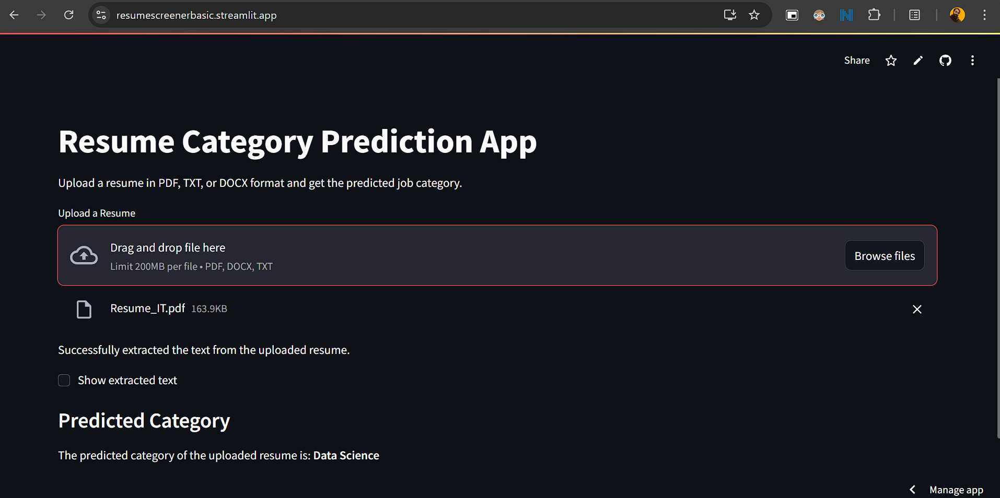

# Resume_Screener_Basic

This is a basic resume screener that filters out the resumes based on the keywords provided by the user.
It uses the method **TF-IDF** which is a very basic method to find the importance of a word in a document relative to a collection of documents in NLP.

I have attached most of the project's files in the repository. The main file is the ***RSB_streamlitApp.py*** file which is the main file that runs the program.
The **ipynb** file is the jupyter notebook file that I used to create the program. The dataset is also attached in the repository.
Run the **ipynb** file to generate all the **pickel files** and then run the ***RSB_streamlitApp.py*** file to run the program.

I have also attached the **requirements.txt** file which contains all the libraries that are required to run the program.

Here is the Preview of the Application Layout:

